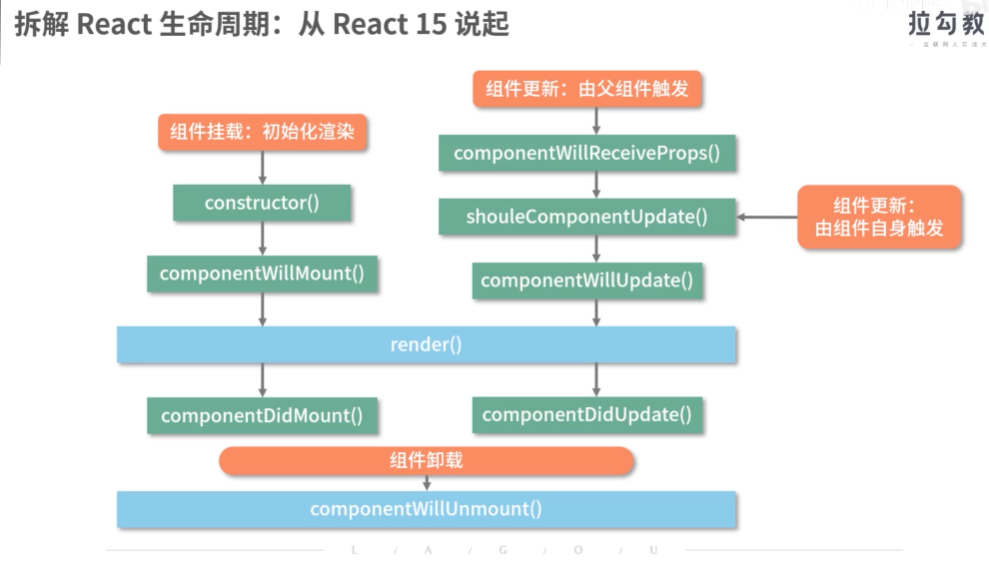
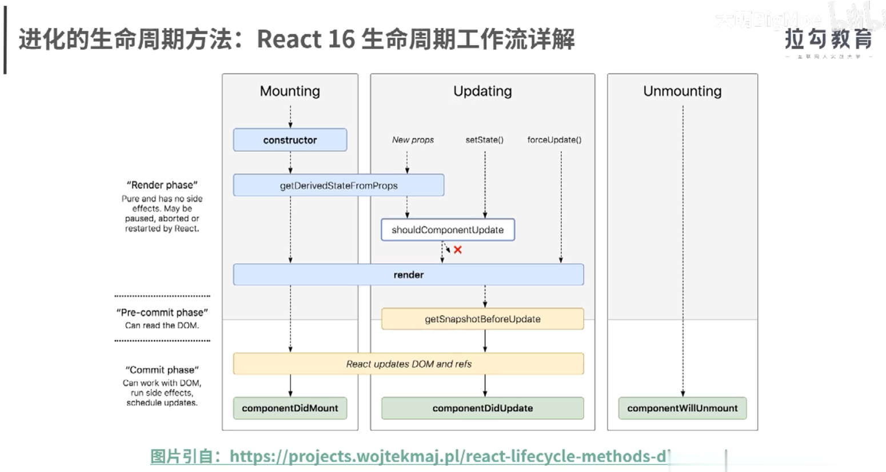

# React
- React.createElement(<节点名字符串>, <属性obj>, <字符串>|<子ReactDOM>...)
- ReactDOM.render(<ReactDOM>, <dom>)
- React.Component(类组件)
  - this.props
  - this.state
  - this.setState(<obj>|(state, props): <obj>): 第一个是异步, 第二个可看成同步
  - componentDidMount
  - componentDidUpdate
  - componentWillUnmount
- HOOK(函数式组件)
  - useState(<初始值>|<初始化函数>): 返回[当前状态, 更新函数]数组
  - 副作用
    - useEffect(() => <返回一个函数或不返回>[, <变量数组>]): 第一次挂载及每次渲染时调用函数, 每次渲染及组件销毁时调用返回的函数, 变量数组没有表示每次渲染调用,为空表示第一次挂载调用, 含变量表示指定变量变化时才调用
    - useLayoutEffect
  - Context
    - createContext(<默认值>)返回一个Context对象
    - <Context对象>.Provider返回一个Provider组件, 指定value属性即可指定向下传递的数据
    - useContext(<Context对象>), 最近的上层对应的Context的Provider传下来的数据
  - Ref
    - useRef(<默认值>), 返回一个Ref对象, 在DOM标签中用ref={<Ref对象>}属性即可捕获该DOM
- jsx语法
  - {}引用
  - 条件渲染: &&, 三目
  - 列表渲染: 属性key

- React.createElement(type, config, ...children)
  - type: 标签|组件
  - config: 属性对象
  - children: 文本|组件
- ReactDOM.render(ReactElement, container[, callback])
- ReactElement
  - $$typeof: Symbol(react.element)
  - key
  - ref
  - type: 标签|组件
  - _self
  - _source: 记录ReactElement所在文件位置
  - _store
  - _owner
  - props
    - children
    - other props

- 初始化阶段: 状态---render()--->ReactDOM---React.render()--->DOM
- 更新阶段: 状态---render()--->ReactDOM---diff算法--->DOM

- 组件化, 工程化
- 封闭, 开放
- 组件的灵魂与躯干: render()方法, 组件生命周期

- React15
  - constructor()
  - componentWillReceiveProps()
  - shouldComponentUpadate()
  - componentWillMount()
  - componentWillUpdate()
  - componentDidUpdate()
  - componentDidMount()
  - render()
  - componentWillUnmount()

- React16

- diff算法
  - 同步渲染, 递归比较前后两颗ReactDOM树
  - Fiber架构, 异步渲染, 将一个大的更新任务拆解为许多个小任务, render阶段, commit阶段

- props
- 发布订阅模式
- context
- redux